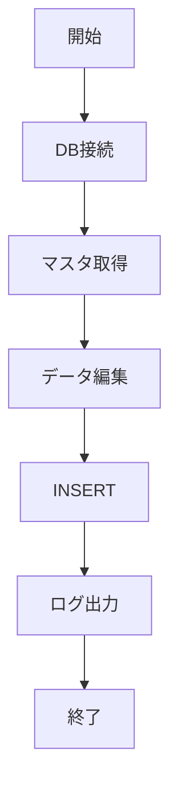

# システム名 / 機能名

> 作成日: 2026-05-23  
> 作成者: ○○  
> バージョン: 1.0.0

---

# 目次

- [1. 概要](#1-概要)
- [2. 前提条件](#2-前提条件)
- [3. 処理概要](#3-処理概要)
- [4. 入力項目](#4-入力項目)
- [5. 出力項目](#5-出力項目)
- [6. 処理フロー](#6-処理フロー)
- [7. エラー処理](#7-エラー処理)
- [8. 注意事項](#8-注意事項)
- [9. 変更履歴](#9-変更履歴)

---


# 1. 概要

本機能は、○○データを取得し、△△テーブルへ登録する機能である。

## 目的

- 業務効率化
- 手作業削減
- データ整合性向上

---

# 2. 前提条件

| 項目 | 内容 |
|---|---|
| OS | Linux / AIX |
| DB | Oracle |
| 言語 | Java |
| 実行方式 | バッチ |

### 実行条件

- DB接続可能であること
- 入力ファイルが存在すること

---

# 3. 処理概要

1. マスタテーブル取得
2. データ編集
3. 登録先テーブルへINSERT
4. ログ出力

---

# 4. 入力項目

| No | 項目名 | 型 | 必須 | 説明 |
|---|---|---|---|---|
| 1 | user_id | String | ○ | ユーザーID |
| 2 | update_date | Date | × | 更新日 |

### サンプル入力

```json
{
  "user_id": "A00001",
  "update_date": "2026-05-23"
}
```

---

# 5. 出力項目

| No | 項目名 | 型 | 説明 |
|---|---|---|---|
| 1 | result_code | String | 結果コード |
| 2 | message | String | 結果メッセージ |

---

# 6. 処理フロー



---

# 7. エラー処理

| エラー内容 | 対応 |
|---|---|
| DB接続失敗 | エラーログ出力後終了 |
| 入力不正 | 警告ログ出力 |
| NullPointerException | 異常終了 |

### エラーログ例

```text
[ERROR] DB接続失敗
ORA-12541: TNS:no listener
```

---

# 8. 注意事項

- 大量データ時は性能影響に注意
- 60万件以上はバッチ分割を検討
- コミット単位を明確にする

---

# 9. 変更履歴

| Ver | 日付 | 作成者 | 内容 |
|---|---|---|---|
| 1.0.0 | 2026-05-23 | ○○ | 初版作成 |