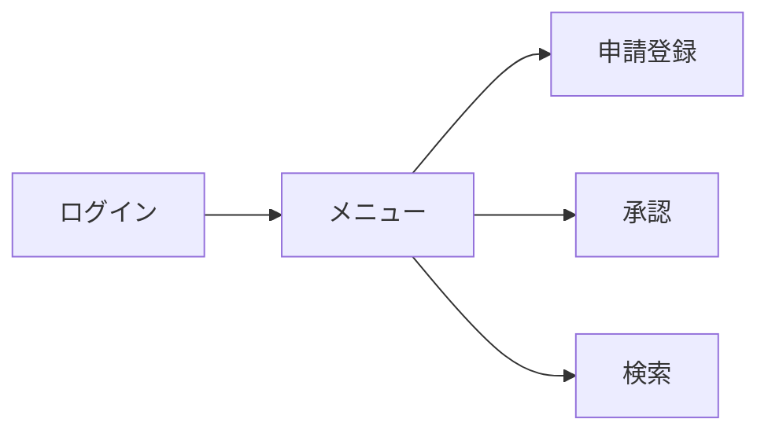
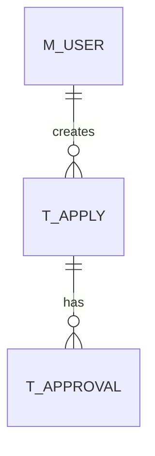

# 基本設計書（サンプル）

## 1. ドキュメント情報

| 項目 | 内容 |
|------|------|
| ドキュメント名 | 基本設計書 |
| システム名 | 〇〇業務システム |
| 版数 | 1.0 |
| 作成日 | 2026/05/24 |
| 作成者 | 〇〇 |

---

## 2. 改訂履歴

| 版数 | 日付 | 内容 | 作成者 |
|------|------|------|--------|
| 1.0 | 2026/05/24 | 初版作成 | 〇〇 |

---

## 3. 目的

本書は、業務要件定義書をもとにシステムの基本設計（外部設計）を定義することを目的とする。

---

## 4. システム概要

本システムは、申請・承認業務を電子化し、業務効率化を図るものである。

---

## 5. 機能概要

### 5.1 機能一覧

| 機能ID | 機能名 | 概要 |
|--------|--------|------|
| SF-001 | 申請登録機能 | 申請情報を登録する |
| SF-002 | 承認機能 | 申請の承認・否認を行う |
| SF-003 | 検索機能 | 申請情報を検索する |

---

## 6. 画面設計

### 6.1 画面一覧

| 画面ID | 画面名 | 概要 |
|--------|--------|------|
| SCR-001 | 申請登録画面 | 申請情報を入力する |
| SCR-002 | 承認画面 | 承認・否認を実施 |
| SCR-003 | 検索画面 | 条件検索を行う |

---

### 6.2 画面遷移図

---

## 7. 帳票設計

### 7.1 帳票一覧

| 帳票ID | 帳票名 | 出力形式 |
|--------|--------|----------|
| REP-001 | 申請一覧 | PDF/CSV |
| REP-002 | 承認履歴 | PDF |

---

## 8. データ設計（概要）

### 8.1 主なテーブル

| テーブル名 | 説明 |
|------------|------|
| T_APPLY | 申請情報 |
| T_APPROVAL | 承認履歴 |
| M_USER | ユーザマスタ |

---

### 8.2 ER概要

---

## 9. インタフェース設計

### 9.1 外部システム連携

| IF ID | 連携先 | 方式 | 内容 |
|------|--------|------|------|
| IF-001 | 会計システム | API | 承認データ連携 |
| IF-002 | メールサーバ | SMTP | 通知送信 |

---

### 9.2 API設計概要

#### ■ 申請登録API

- URL: /api/apply
- Method: POST
- 入力: 申請情報
- 出力: 受付結果

---

## 10. 入出力設計

### 10.1 入力項目

| 項目名 | 型 | 必須 | 説明 |
|--------|----|------|------|
| 申請ID | string | ○ | 一意ID |
| 申請内容 | string | ○ | 内容 |

---

### 10.2 出力項目

- 承認結果
- 検索結果一覧
- 帳票データ

---

## 11. 例外・エラー設計

| エラーコード | 内容 | 対応 |
|--------------|------|------|
| E001 | 入力チェックエラー | メッセージ表示 |
| E002 | システムエラー | ログ出力・画面エラー |

---

## 12. バッチ設計（概要）

| バッチID | 内容 | 実行時間 |
|----------|------|----------|
| B-001 | 日次集計 | 01:00 |

---

## 13. 非機能設計（概要）

| 区分 | 内容 |
|------|------|
| 性能 | 検索3秒以内 |
| 可用性 | 99.5%以上 |
| セキュリティ | RBAC |

---

## 14. 運用設計（概要）

- ログ監視
- バッチ監視
- 障害通知メール

---

## 15. 付録

- 要件定義書
- 業務フロー
- インタフェース仕様書

