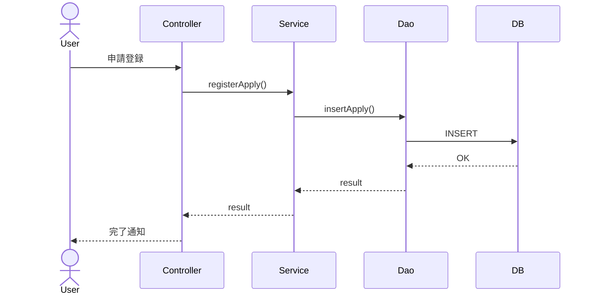
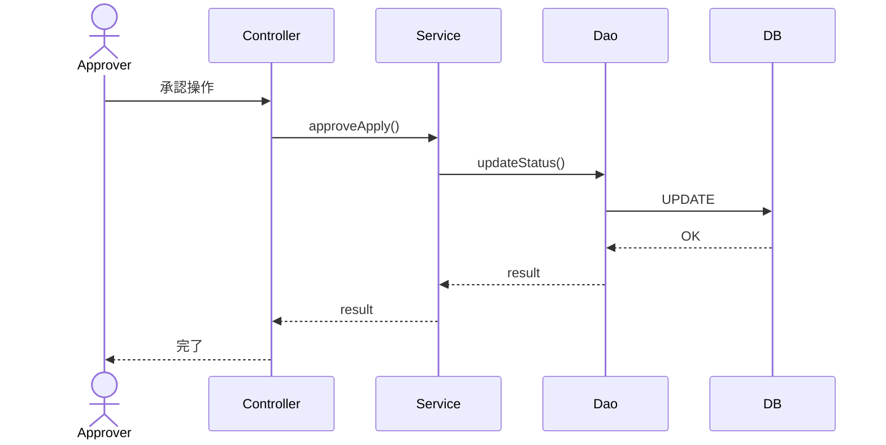

# 詳細設計書（サンプル）

## 1. ドキュメント情報

| 項目 | 内容 |
|------|------|
| ドキュメント名 | 詳細設計書 |
| システム名 | 〇〇業務システム |
| 版数 | 1.0 |
| 作成日 | 2026/05/24 |
| 作成者 | 〇〇 |

---

## 2. 改訂履歴

| 版数 | 日付 | 内容 | 作成者 |
|------|------|------|--------|
| 1.0 | 2026/05/24 | 初版作成 | 〇〇 |

---

## 3. 目的

本書は、基本設計書をもとに、実装レベルの設計（クラス設計・SQL設計・処理ロジック）を定義することを目的とする。

---

## 4. アーキテクチャ概要

- Webアプリケーション構成
- 3層アーキテクチャ（Presentation / Business / Data）
- Javaベース想定

---

## 5. クラス設計

### 5.1 クラス一覧

| クラス名 | 説明 |
|----------|------|
| ApplyController | 申請画面制御 |
| ApplyService | 申請ビジネスロジック |
| ApplyDao | DBアクセス |
| ApplyEntity | 申請データモデル |

---

### 5.2 クラス詳細

#### ■ ApplyController

- 役割：画面リクエスト制御
- 主なメソッド

| メソッド名 | 説明 |
|------------|------|
| submitApply() | 申請登録処理呼び出し |
| searchApply() | 検索処理呼び出し |

---

#### ■ ApplyService

- 役割：業務ロジック制御

| メソッド名 | 処理内容 |
|------------|----------|
| registerApply() | 申請登録処理 |
| approveApply() | 承認処理 |

---

## 6. シーケンス設計（処理フロー）

### 6.1 申請登録処理



---

### 6.2 承認処理フロー



---

## 7. SQL設計

### 7.1 テーブル定義

#### ■ T_APPLY（申請テーブル）

| カラム名 | 型 | 制約 | 説明 |
|----------|----|------|------|
| APPLY_ID | VARCHAR2(20) | PK | 申請ID |
| USER_ID | VARCHAR2(20) | NOT NULL | 申請者ID |
| CONTENT | VARCHAR2(500) |  | 申請内容 |
| STATUS | VARCHAR2(10) |  | ステータス |
| CREATE_DATE | DATE |  | 作成日 |

---

### 7.2 DDL

```sql
CREATE TABLE T_APPLY (
    APPLY_ID VARCHAR2(20) PRIMARY KEY,
    USER_ID VARCHAR2(20) NOT NULL,
    CONTENT VARCHAR2(500),
    STATUS VARCHAR2(10),
    CREATE_DATE DATE
);
```

---

### 7.3 SQL（CRUD例）

#### ■ 申請登録

```sql
INSERT INTO T_APPLY (
    APPLY_ID,
    USER_ID,
    CONTENT,
    STATUS,
    CREATE_DATE
) VALUES (
    ?, ?, ?, 'NEW', SYSDATE
);
```

---

#### ■ 申請検索

```sql
SELECT *
FROM T_APPLY
WHERE USER_ID = ?
  AND STATUS = ?;
```

---

#### ■ 承認更新

```sql
UPDATE T_APPLY
SET STATUS = 'APPROVED'
WHERE APPLY_ID = ?;
```

---

## 8. 例外設計

| 例外 | 内容 | 対応 |
|------|------|------|
| BusinessException | 業務エラー | メッセージ返却 |
| SystemException | システム障害 | ログ出力＋画面エラー |

---

## 9. 入出力処理設計

### 9.1 入力チェック

- 必須チェック
- 桁数チェック
- 禁則文字チェック

---

### 9.2 出力処理

- JSONレスポンス
- 画面表示用DTO生成

---

## 10. ログ設計

| ログ種別 | 内容 |
|----------|------|
| INFO | 通常処理 |
| WARN | 警告 |
| ERROR | エラー |

---

## 11. トランザクション設計

- 申請登録：単一トランザクション
- 承認処理：更新＋履歴登録を同一Tx

---

## 12. 性能設計（簡易）

- SELECT：3秒以内
- バッチ処理：1時間以内に完了

---

## 13. セキュリティ設計

- ロールベースアクセス制御（RBAC）
- SQLインジェクション対策（PreparedStatement）
- 認可チェック（Service層）

---

## 14. 付録

- 基本設計書リンク
- 業務要件定義書リンク

